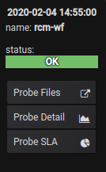
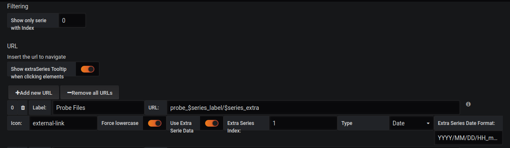

[](https://github.com/flant/grafana-statusmap/releases/latest)
[](https://t.me/statusmap_ru)
[](https://cloud-native.slack.com/messages/CHGSGTAHY)

# Statusmap panel for Grafana


## Features

* Grouping values into rows and buckets using legend from query
* User defined color mapping
* Multiple values in bucket are displayed via tooltip
* Increasing rows/buckets' interval for better visual representation
* Representing null values as empty bucket or zero value

:calendar: New features are planned in [#62](https://github.com/flant/grafana-statusmap/issues/62)

### Supported environment

* Tested with datasources:
  - Prometheus
  - InfluxDB
  - Mysql
* Tested with Grafana:
  - 5.1.3
  - 5.4.3
  - 6.0.0

## Installation

Plugin can be installed with GF_INSTALL_PLUGINS="flant-statusmap-panel" or you can use Git and clone this repo:

```
git clone git@github.com:flant/grafana-statusmap.git /var/lib/grafana/plugins/flant-statusmap-panel
```

Alternatively, you can download [ZIP archive](https://github.com/flant/grafana-statusmap/archive/master.zip)
of this repo and unpack it into /var/lib/grafana/plugins directory.


## Motivation

We had a desperate need to visualize a set of timeseries statuses over time period, so we can
see a history of changes for objects' status. Since we maintain a lot of Kubernetes clusters
(and related infrastructure), our main cases for that are visualization of servers & Kubernetes
pods health states as well as HTTP services health checks. We've tried a variety of Grafana
plugins available (they are listed in *Acknowledgements* below) but none of them could provide
the features and visualization really close to what we've been looking for.

_NB: You can find more details about our journey of creating the plugin in
[this post](https://medium.com/flant-com/statusmap-grafana-plugin-to-visualize-status-over-time-fe6ced391853)._

_Objects_ being visualized with this plugin may be different: not only IT components (e.g. server
hosts and Kubernetes pods) but just anything you can imagine like coffee makers on the picture
above. These objects should have _discrete statuses_ which are sets of predefined values, e.g.
`ok` = 0, `off` = 1, `fail` = 2, etc.

## Configuration

### Datasource notes

To create neat graphs your datasource should return good data. Plugin adjust `$__interval` variable depending on
bucket width in panel options. Your queries should aggregate statuses over `$__interval`.

To make multiple values mode works as expected you should define multiple queries: one query for each possible status.

Plugin doesn't aggregate data in time for now, it only renders input data as buckets. Because of this
data should contain points for each timestamp in time range and equal timestamps for every possible
target (y-axis label). This limitation is addressed by [issue #53](https://github.com/flant/grafana-statusmap/issues/53).

#### Prometheus

To work with data from Prometheus you will need to setup discrete statuses for your objects.
Requirements to store these statuses in metrics are as follows:
* metrics should have two values: `0` and `1`;
* there should be a label with status' value.

When it's done, you can collect all the data via query, e.g.:

```
(max_over_time(coffee_maker_status{status="<STATUS_VALUE>"}[$__interval]) == 1) * <STATUS_VALUE>
```

If there was no such status (`<STATUS_VALUE>`) during query's interval, Prometheus would
return nothing. Otherwise, status' value will be returned.

For example, if you have 5 types of statuses and a metric (`coffee_maker_status`) with 5
allowed values (`0`, `1`, `2`, `3`, `4`), you should transform this metric using following rule:

```
- record: coffee_maker_status:discrete
  expr: |
    count_values("status", coffee_maker_status)
```

That's how `coffee_maker_status` metric with value `3` will be transformed into new metric:

```
coffee_maker_status:discrete{status="3"} 1
```

Now, when Prometheus has `0` and `1` values for each status, all these metrics can be
aggregated, so you will get all available statuses of your objects over time.

#### InfluxDB

Choose 'Time series' for 'Format as' and use `GROUP BY ($__interval)` in query. `$tag_<tag name>` can be used in 'Alias by' to define y-axis labels.

#### Mysql

Example query with aggregation over `$__interval` is like this (you need one query for each possible status value):

```
SELECT
  $__timeGroupAlias(date_insert,$__interval),
  name AS metric,
  min(statusi) AS "statusi"
FROM coffee_makers
WHERE
  $__timeFilter(date_insert) AND statusi=1
GROUP BY 1,2
ORDER BY $__timeGroup(date_insert,$__interval)
```

`metric` column is used as y-axis label.

### Panel

First of all, an individual query for each possible status' value should be created.
Each query should also have similar legend for grouping:


Then, color mapping for status' values should be defined in __Discrete__ color mode:


Use can use presets to define a trafic light colors or 8 colors from [solarized](https://ethanschoonover.com/solarized/) palette:


_Note: __Spectrum__ and __Opacity__ color modes function the same way they do in [Heatmap](https://grafana.com/plugins/heatmap) plugin._


### More options

#### Bucket


__Multiple values__ checkbox specifies how they should be displayed:
* If it's off, multiple values for one bucket are treated as error;
* If it's on, color for such bucket would be determined by the value having least index in color mapping.


__Null values__ can be treated as empty buckets or displayed with the color of `0` value.


__Min width__ and __spacing__ are used to specify minimal bucket width and spacing between buckets.
__Rounding__ may be used to round edges.


#### Display


__Show legend__ checkbox toggles legend at the bottom of the panel.

__Show tooltip__ toggles tooltip display on mouse over buckets.

__Y axis sort__ can be used to sort labels on Y axis. Metrics — sort y labels as they are defined on Metrics tab. a→z and z→a sort labels descending or ascending in a [natural](https://developer.mozilla.org/ru/docs/Web/JavaScript/Reference/Global_Objects/String/localeCompare) order.

#### Tooltip with external link


A new tooltip that will appear when mouse click in a value showing one or more links to navigate. It can be configured in the options editor. Also it can be disabled to not appear. 

#### Tooltip editor


__Show Extra Series Tooltip when clicking elements__ toggles tooltip with links display on mouse click.

__Add new URL__ creates a new form to add a new link

__Remove all URLs__ removes all the urls created before

__Label__ name to show in the link instead of the URL

__URL__ URL to navigate

__Icon__ icon to show next to the url

__Force lowercase__ forces the url to be lowercase even if it is written in capital letters

__Extra Series Completer__ toggles extra series to write the URL

__Extra Series Index__ fields index to use its value on URL using $series_extra. Use -1 to disable it

__Extra Series Date Format__ date format to transform extra herlper when its type is Date

## Development

To test and improve the plugin you can run Grafana instance in Docker using following command (in
the directory containing Statusmap plugin):

```
docker run --rm -it -v $PWD:/var/lib/grafana/plugins/flant-statusmap-panel \
           -p 3000:3000 --name grafana.docker \
           --env=GF_USERS_DEFAULT_THEME=light \
           grafana/grafana:5.1.3
```

This will expose local plugin from your machine to Grafana container. Now run `grunt` to compile
dist directory and start changes watcher:

```
grunt watch
```

## Acknowledgements

The first public release of this plugin has been fully made by [Flant](https://flant.com/) engineers. The whole idea has come from Dmitry Stolyarov ([@distol](https://github.com/distol)), initial version has been written by Sergey Gnuskov ([@gsmetal](https://github.com/gsmetal)) and final changes has been made by Ivan Mikheykin ([@diafour](https://github.com/diafour)).

This plugin is based on "Heatmap" panel by Grafana and partly inspired by ideas from Carpet plot, Discrete panel, Status Panel, Status Dot, Status By Group.


### CHANGELOG

The latest changes can be found here: [CHANGELOG.md](https://github.com/flant/grafana-statusmap/blob/master/CHANGELOG.md)
